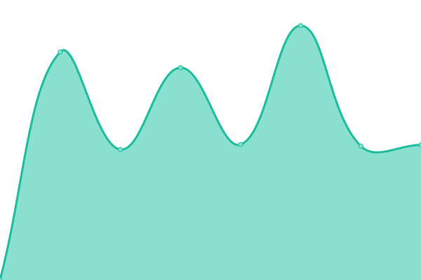
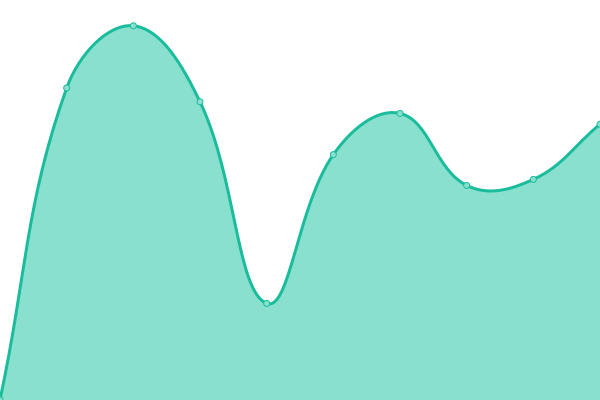
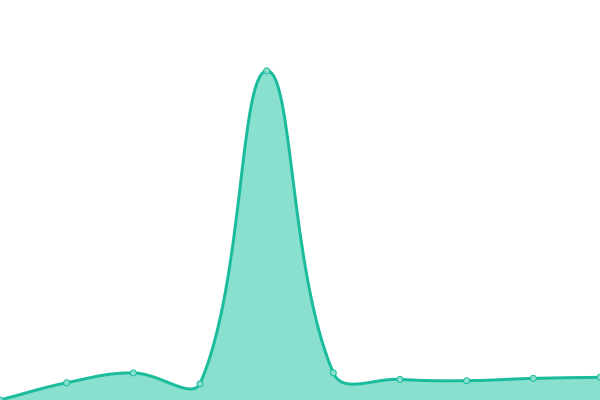
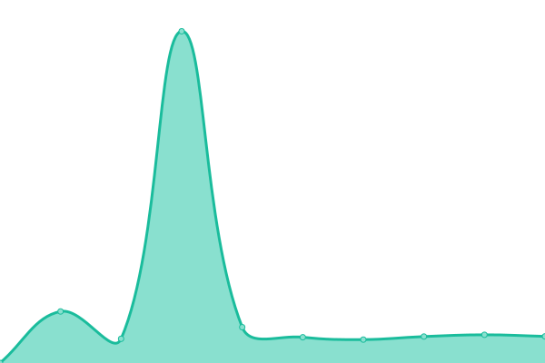
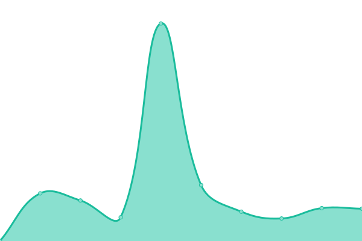

# [📈 Live Status](https://One-Gloucestershire.github.io/WebsiteMonitor): <!--live status--> **🟧 Partial outage**

This repository contains the open-source uptime monitor and status page for [One-Gloucestershire](https://www.onegloucestershire.net), powered by [Upptime](https://github.com/upptime/upptime).

With [Upptime](https://upptime.js.org), you can get your own unlimited and free uptime monitor and status page, powered entirely by a GitHub repository. We use [Issues](https://github.com/One-Gloucestershire/WebsiteMonitor/issues) as incident reports, [Actions](https://github.com/One-Gloucestershire/WebsiteMonitor/actions) as uptime monitors, and [Pages](https://One-Gloucestershire.github.io/WebsiteMonitor) for the status page.

<!--start: status pages-->
<!-- This summary is generated by Upptime (https://github.com/upptime/upptime) -->
<!-- Do not edit this manually, your changes will be overwritten -->
<!-- prettier-ignore -->
| URL | Status | History | Response Time | Uptime |
| --- | ------ | ------- | ------------- | ------ |
|  [Aspen Medical Practice](https://www.aspenmedicalpractice.nhs.uk/) | 🟩 Up | [aspen-medical-practice.yml](https://github.com/One-Gloucestershire/WebsiteMonitor/commits/HEAD/history/aspen-medical-practice.yml) | 

 1249ms
     
 | 

<a href="https://One-Gloucestershire.github.io/WebsiteMonitor/history/aspen-medical-practice">100.00%</a>
    

|  [Beeches Green Surgery](https://beechesgreensurgery.co.uk/) | 🟩 Up | [beeches-green-surgery.yml](https://github.com/One-Gloucestershire/WebsiteMonitor/commits/HEAD/history/beeches-green-surgery.yml) | 

 869ms
     
 | 

<a href="https://One-Gloucestershire.github.io/WebsiteMonitor/history/beeches-green-surgery">100.00%</a>
    

|  [Berkeley Place Surgery](https://berkeleyplacesurgery.nhs.uk/) | 🟩 Up | [berkeley-place-surgery.yml](https://github.com/One-Gloucestershire/WebsiteMonitor/commits/HEAD/history/berkeley-place-surgery.yml) | 

 1016ms
     
 | 

<a href="https://One-Gloucestershire.github.io/WebsiteMonitor/history/berkeley-place-surgery">100.00%</a>
    

|  [Blakeney Surgery](https://www.blakeneysurgery.nhs.uk/) | 🟩 Up | [blakeney-surgery.yml](https://github.com/One-Gloucestershire/WebsiteMonitor/commits/HEAD/history/blakeney-surgery.yml) | 

 1148ms
     
 | 

<a href="https://One-Gloucestershire.github.io/WebsiteMonitor/history/blakeney-surgery">100.00%</a>
    

|  [Brockworth Surgery](https://brockworthsurgery.nhs.uk/) | 🟩 Up | [brockworth-surgery.yml](https://github.com/One-Gloucestershire/WebsiteMonitor/commits/HEAD/history/brockworth-surgery.yml) | 

 613ms
     
 | 

<a href="https://One-Gloucestershire.github.io/WebsiteMonitor/history/brockworth-surgery">100.00%</a>
    

|  [Cam & Uley Family Practice](https://cam-and-uley.nhs.uk/) | 🟩 Up | [cam-and-uley-family-practice.yml](https://github.com/One-Gloucestershire/WebsiteMonitor/commits/HEAD/history/cam-and-uley-family-practice.yml) | 

 619ms
     
 | 

<a href="https://One-Gloucestershire.github.io/WebsiteMonitor/history/cam-and-uley-family-practice">100.00%</a>
    

|  [Chipping Campden Surgery](https://www.chippingcampdensurgery.co.uk/) | 🟩 Up | [chipping-campden-surgery.yml](https://github.com/One-Gloucestershire/WebsiteMonitor/commits/HEAD/history/chipping-campden-surgery.yml) | 

 1269ms
     
 | 

<a href="https://One-Gloucestershire.github.io/WebsiteMonitor/history/chipping-campden-surgery">100.00%</a>
    

|  [Churchdown Surgery](https://www.churchdownsurgery.co.uk/) | 🟩 Up | [churchdown-surgery.yml](https://github.com/One-Gloucestershire/WebsiteMonitor/commits/HEAD/history/churchdown-surgery.yml) | 

 1378ms
     
 | 

<a href="https://One-Gloucestershire.github.io/WebsiteMonitor/history/churchdown-surgery">100.00%</a>
    

|  [Church Street Medical Practice](https://www.inspire-healthcare.co.uk/church-street-medical/) | 🟩 Up | [church-street-medical-practice.yml](https://github.com/One-Gloucestershire/WebsiteMonitor/commits/HEAD/history/church-street-medical-practice.yml) | 

 804ms
     
 | 

<a href="https://One-Gloucestershire.github.io/WebsiteMonitor/history/church-street-medical-practice">100.00%</a>
    

|  [Cirencester Health Group](https://cirencesterhealthgroup.co.uk/) | 🟥 Down | [cirencester-health-group.yml](https://github.com/One-Gloucestershire/WebsiteMonitor/commits/HEAD/history/cirencester-health-group.yml) | 

 774ms
     
 | 

<a href="https://One-Gloucestershire.github.io/WebsiteMonitor/history/cirencester-health-group">100.00%</a>
    

|  [Cleevelands Medical Centre](https://cleevelandsmedicalcentre.org.uk/) | 🟩 Up | [cleevelands-medical-centre.yml](https://github.com/One-Gloucestershire/WebsiteMonitor/commits/HEAD/history/cleevelands-medical-centre.yml) | 

 595ms
     
 | 

<a href="https://One-Gloucestershire.github.io/WebsiteMonitor/history/cleevelands-medical-centre">100.00%</a>
    

|  [Coleford Medical Practice](https://colefordmedicalpractice.nhs.uk/) | 🟩 Up | [coleford-medical-practice.yml](https://github.com/One-Gloucestershire/WebsiteMonitor/commits/HEAD/history/coleford-medical-practice.yml) | 

 1018ms
     
 | 

<a href="https://One-Gloucestershire.github.io/WebsiteMonitor/history/coleford-medical-practice">100.00%</a>
    

|  [Cotswold Medical Practice](https://www.cotswoldmedicalpractice.nhs.uk/) | 🟩 Up | [cotswold-medical-practice.yml](https://github.com/One-Gloucestershire/WebsiteMonitor/commits/HEAD/history/cotswold-medical-practice.yml) | 

 1238ms
     
 | 

<a href="https://One-Gloucestershire.github.io/WebsiteMonitor/history/cotswold-medical-practice">100.00%</a>
    

|  [Culverhay Surgery](https://www.culverhaysurgery.com/) | 🟩 Up | [culverhay-surgery.yml](https://github.com/One-Gloucestershire/WebsiteMonitor/commits/HEAD/history/culverhay-surgery.yml) | 

 1609ms
     
 | 

<a href="https://One-Gloucestershire.github.io/WebsiteMonitor/history/culverhay-surgery">100.00%</a>
    

|  [Dockham Road Surgery](https://dockhamsurgery.nhs.uk/) | 🟩 Up | [dockham-road-surgery.yml](https://github.com/One-Gloucestershire/WebsiteMonitor/commits/HEAD/history/dockham-road-surgery.yml) | 

 743ms
     
 | 

<a href="https://One-Gloucestershire.github.io/WebsiteMonitor/history/dockham-road-surgery">100.00%</a>
    

|  [Drybrook Surgery](https://www.drybrooksurgery.nhs.uk/) | 🟩 Up | [drybrook-surgery.yml](https://github.com/One-Gloucestershire/WebsiteMonitor/commits/HEAD/history/drybrook-surgery.yml) | 

 1140ms
     
 | 

<a href="https://One-Gloucestershire.github.io/WebsiteMonitor/history/drybrook-surgery">100.00%</a>
    

|  [Five Valleys Medical](https://fivevalleysmedicalpractice.co.uk/) | 🟩 Up | [five-valleys-medical.yml](https://github.com/One-Gloucestershire/WebsiteMonitor/commits/HEAD/history/five-valleys-medical.yml) | 

 743ms
     
 | 

<a href="https://One-Gloucestershire.github.io/WebsiteMonitor/history/five-valleys-medical">100.00%</a>
    

|  [Forest Health Centre](https://www.foresthealthcentre.nhs.uk/) | 🟩 Up | [forest-health-centre.yml](https://github.com/One-Gloucestershire/WebsiteMonitor/commits/HEAD/history/forest-health-centre.yml) | 

 1169ms
     
 | 

<a href="https://One-Gloucestershire.github.io/WebsiteMonitor/history/forest-health-centre">100.00%</a>
    

|  [Frithwood Surgery](https://frithwoodsurgery.nhs.uk/) | 🟩 Up | [frithwood-surgery.yml](https://github.com/One-Gloucestershire/WebsiteMonitor/commits/HEAD/history/frithwood-surgery.yml) | 

 579ms
     
 | 

<a href="https://One-Gloucestershire.github.io/WebsiteMonitor/history/frithwood-surgery">100.00%</a>
    

|  [Gloucester Health Access Centre](https://www.ghac.co.uk/) | 🟩 Up | [gloucester-health-access-centre.yml](https://github.com/One-Gloucestershire/WebsiteMonitor/commits/HEAD/history/gloucester-health-access-centre.yml) | 

 1212ms
     
 | 

<a href="https://One-Gloucestershire.github.io/WebsiteMonitor/history/gloucester-health-access-centre">100.00%</a>
    

|  [Hilary Cottage Surgery](https://fairfordsurgery.co.uk/) | 🟩 Up | [hilary-cottage-surgery.yml](https://github.com/One-Gloucestershire/WebsiteMonitor/commits/HEAD/history/hilary-cottage-surgery.yml) | 

 753ms
     
 | 

<a href="https://One-Gloucestershire.github.io/WebsiteMonitor/history/hilary-cottage-surgery">100.00%</a>
    

|  [Hucclecote Surgery](https://www.hucclecotesurgery.co.uk/) | 🟩 Up | [hucclecote-surgery.yml](https://github.com/One-Gloucestershire/WebsiteMonitor/commits/HEAD/history/hucclecote-surgery.yml) | 

 1252ms
     
 | 

<a href="https://One-Gloucestershire.github.io/WebsiteMonitor/history/hucclecote-surgery">100.00%</a>
    

|  [Kingsholm Surgery](https://www.kingsholmsurgery.co.uk/) | 🟩 Up | [kingsholm-surgery.yml](https://github.com/One-Gloucestershire/WebsiteMonitor/commits/HEAD/history/kingsholm-surgery.yml) | 

 1271ms
     
 | 

<a href="https://One-Gloucestershire.github.io/WebsiteMonitor/history/kingsholm-surgery">100.00%</a>
    

|  [Longlevens Surgery](https://www.longlevens-surgery.nhs.uk/) | 🟩 Up | [longlevens-surgery.yml](https://github.com/One-Gloucestershire/WebsiteMonitor/commits/HEAD/history/longlevens-surgery.yml) | 

 1152ms
     
 | 

<a href="https://One-Gloucestershire.github.io/WebsiteMonitor/history/longlevens-surgery">100.00%</a>
    

|  [Mann Cottage Surgery](https://www.moretondoctors.nhs.uk/) | 🟩 Up | [mann-cottage-surgery.yml](https://github.com/One-Gloucestershire/WebsiteMonitor/commits/HEAD/history/mann-cottage-surgery.yml) | 

 1045ms
     
 | 

<a href="https://One-Gloucestershire.github.io/WebsiteMonitor/history/mann-cottage-surgery">100.00%</a>
    

|  [May Lane Surgery](https://maylanesurgery.co.uk/) | 🟩 Up | [may-lane-surgery.yml](https://github.com/One-Gloucestershire/WebsiteMonitor/commits/HEAD/history/may-lane-surgery.yml) | 

 753ms
     
 | 

<a href="https://One-Gloucestershire.github.io/WebsiteMonitor/history/may-lane-surgery">100.00%</a>
    

|  [Minchinhampton Surgery](https://www.minchsurgery.nhs.uk/) | 🟩 Up | [minchinhampton-surgery.yml](https://github.com/One-Gloucestershire/WebsiteMonitor/commits/HEAD/history/minchinhampton-surgery.yml) | 

 1051ms
     
 | 

<a href="https://One-Gloucestershire.github.io/WebsiteMonitor/history/minchinhampton-surgery">100.00%</a>
    

|  [Mitcheldean Surgery](https://www.mitcheldeansurgery.co.uk/) | 🟩 Up | [mitcheldean-surgery.yml](https://github.com/One-Gloucestershire/WebsiteMonitor/commits/HEAD/history/mitcheldean-surgery.yml) | 

 1292ms
     
 | 

<a href="https://One-Gloucestershire.github.io/WebsiteMonitor/history/mitcheldean-surgery">100.00%</a>
    

|  [Mythe Medical Practice](https://www.mythemedical.co.uk/) | 🟩 Up | [mythe-medical-practice.yml](https://github.com/One-Gloucestershire/WebsiteMonitor/commits/HEAD/history/mythe-medical-practice.yml) | 

 1583ms
     
 | 

<a href="https://One-Gloucestershire.github.io/WebsiteMonitor/history/mythe-medical-practice">100.00%</a>
    

|  [Newent Family Practice](https://www.newentdoctors.nhs.uk/) | 🟩 Up | [newent-family-practice.yml](https://github.com/One-Gloucestershire/WebsiteMonitor/commits/HEAD/history/newent-family-practice.yml) | 

 1601ms
     
 | 

<a href="https://One-Gloucestershire.github.io/WebsiteMonitor/history/newent-family-practice">100.00%</a>
    

|  [Overton Park Surgery](https://overtonparksurgery.com/) | 🟩 Up | [overton-park-surgery.yml](https://github.com/One-Gloucestershire/WebsiteMonitor/commits/HEAD/history/overton-park-surgery.yml) | 

 703ms
     
 | 

<a href="https://One-Gloucestershire.github.io/WebsiteMonitor/history/overton-park-surgery">100.00%</a>
    

|  [Painswick Surgery](https://www.painswicksurgery.nhs.uk/) | 🟩 Up | [painswick-surgery.yml](https://github.com/One-Gloucestershire/WebsiteMonitor/commits/HEAD/history/painswick-surgery.yml) | 

 1406ms
     
 | 

<a href="https://One-Gloucestershire.github.io/WebsiteMonitor/history/painswick-surgery">100.00%</a>
    

|  [Partners in Health](https://www.partnersinhealthgloucester.nhs.uk/) | 🟩 Up | [partners-in-health.yml](https://github.com/One-Gloucestershire/WebsiteMonitor/commits/HEAD/history/partners-in-health.yml) | 

 0ms
     
 | 

<a href="https://One-Gloucestershire.github.io/WebsiteMonitor/history/partners-in-health">100.00%</a>
    

|  [Phoenix Health Group](https://phoenixhealthgroup.co.uk/) | 🟩 Up | [phoenix-health-group.yml](https://github.com/One-Gloucestershire/WebsiteMonitor/commits/HEAD/history/phoenix-health-group.yml) | 

 784ms
     
 | 

<a href="https://One-Gloucestershire.github.io/WebsiteMonitor/history/phoenix-health-group">100.00%</a>
    

|  [Prices Mill Surgery](https://pricesmill.co.uk/) | 🟩 Up | [prices-mill-surgery.yml](https://github.com/One-Gloucestershire/WebsiteMonitor/commits/HEAD/history/prices-mill-surgery.yml) | 

 758ms
     
 | 

<a href="https://One-Gloucestershire.github.io/WebsiteMonitor/history/prices-mill-surgery">100.00%</a>
    

|  [Quedgeley Medical Centre](https://www.quedgeleymedicalcentre.nhs.uk/) | 🟩 Up | [quedgeley-medical-centre.yml](https://github.com/One-Gloucestershire/WebsiteMonitor/commits/HEAD/history/quedgeley-medical-centre.yml) | 

 1145ms
     
 | 

<a href="https://One-Gloucestershire.github.io/WebsiteMonitor/history/quedgeley-medical-centre">100.00%</a>
    

|  [Rendcomb Surgery](https://www.rendcombsurgery.co.uk/) | 🟩 Up | [rendcomb-surgery.yml](https://github.com/One-Gloucestershire/WebsiteMonitor/commits/HEAD/history/rendcomb-surgery.yml) | 

 1779ms
     
 | 

<a href="https://One-Gloucestershire.github.io/WebsiteMonitor/history/rendcomb-surgery">100.00%</a>
    

|  [Rosebank Health](https://rosebankhealth.nhs.uk/) | 🟩 Up | [rosebank-health.yml](https://github.com/One-Gloucestershire/WebsiteMonitor/commits/HEAD/history/rosebank-health.yml) | 

 629ms
     
 | 

<a href="https://One-Gloucestershire.github.io/WebsiteMonitor/history/rosebank-health">100.00%</a>
    

|  [Rowcroft Medical Centre](https://rowcroftmc.nhs.uk/) | 🟩 Up | [rowcroft-medical-centre.yml](https://github.com/One-Gloucestershire/WebsiteMonitor/commits/HEAD/history/rowcroft-medical-centre.yml) | 

 747ms
     
 | 

<a href="https://One-Gloucestershire.github.io/WebsiteMonitor/history/rowcroft-medical-centre">100.00%</a>
    

|  [Royal Crescent Surgery](https://royalcrescentsurgery.nhs.uk/) | 🟩 Up | [royal-crescent-surgery.yml](https://github.com/One-Gloucestershire/WebsiteMonitor/commits/HEAD/history/royal-crescent-surgery.yml) | 

 708ms
     
 | 

<a href="https://One-Gloucestershire.github.io/WebsiteMonitor/history/royal-crescent-surgery">100.00%</a>
    

|  [Royal Well Surgery](https://www.royalwell.co.uk/) | 🟩 Up | [royal-well-surgery.yml](https://github.com/One-Gloucestershire/WebsiteMonitor/commits/HEAD/history/royal-well-surgery.yml) | 

 1750ms
     
 | 

<a href="https://One-Gloucestershire.github.io/WebsiteMonitor/history/royal-well-surgery">100.00%</a>
    

|  [Severnbank Surgery](https://www.severnbanksurgery.co.uk/) | 🟩 Up | [severnbank-surgery.yml](https://github.com/One-Gloucestershire/WebsiteMonitor/commits/HEAD/history/severnbank-surgery.yml) | 

 1718ms
     
 | 

<a href="https://One-Gloucestershire.github.io/WebsiteMonitor/history/severnbank-surgery">100.00%</a>
    

|  [Severnside Medical Practice](https://www.severnsidemedicalpractice.co.uk/) | 🟩 Up | [severnside-medical-practice.yml](https://github.com/One-Gloucestershire/WebsiteMonitor/commits/HEAD/history/severnside-medical-practice.yml) | 

 1393ms
     
 | 

<a href="https://One-Gloucestershire.github.io/WebsiteMonitor/history/severnside-medical-practice">100.00%</a>
    

|  [Sixways Clinic](https://sixwaysclinic.co.uk/) | 🟩 Up | [sixways-clinic.yml](https://github.com/One-Gloucestershire/WebsiteMonitor/commits/HEAD/history/sixways-clinic.yml) | 

 747ms
     
 | 

<a href="https://One-Gloucestershire.github.io/WebsiteMonitor/history/sixways-clinic">100.00%</a>
    

|  [Staunton & Corse Surgery](https://stauntonsurgery.co.uk/) | 🟩 Up | [staunton-and-corse-surgery.yml](https://github.com/One-Gloucestershire/WebsiteMonitor/commits/HEAD/history/staunton-and-corse-surgery.yml) | 

 960ms
     
 | 

<a href="https://One-Gloucestershire.github.io/WebsiteMonitor/history/staunton-and-corse-surgery">100.00%</a>
    

|  [St Catherine’s Surgery](https://www.inspire-healthcare.co.uk/st-catherine-s-surgery/) | 🟩 Up | [st-catherine-s-surgery.yml](https://github.com/One-Gloucestershire/WebsiteMonitor/commits/HEAD/history/st-catherine-s-surgery.yml) | 

 703ms
     
 | 

<a href="https://One-Gloucestershire.github.io/WebsiteMonitor/history/st-catherine-s-surgery">100.00%</a>
    

|  [St George’s Surgery](https://www.st-georgessurgery.co.uk/) | 🟩 Up | [st-george-s-surgery.yml](https://github.com/One-Gloucestershire/WebsiteMonitor/commits/HEAD/history/st-george-s-surgery.yml) | 

 1971ms
     
 | 

<a href="https://One-Gloucestershire.github.io/WebsiteMonitor/history/st-george-s-surgery">100.00%</a>
    

|  [Stoke Road Surgery](https://www.stokeroadsurgery.co.uk/) | 🟩 Up | [stoke-road-surgery.yml](https://github.com/One-Gloucestershire/WebsiteMonitor/commits/HEAD/history/stoke-road-surgery.yml) | 

 1252ms
     
 | 

<a href="https://One-Gloucestershire.github.io/WebsiteMonitor/history/stoke-road-surgery">100.00%</a>
    

|  [Stonehouse Health Clinic](https://stonehousehealthclinic.nhs.uk/) | 🟩 Up | [stonehouse-health-clinic.yml](https://github.com/One-Gloucestershire/WebsiteMonitor/commits/HEAD/history/stonehouse-health-clinic.yml) | 

 678ms
     
 | 

<a href="https://One-Gloucestershire.github.io/WebsiteMonitor/history/stonehouse-health-clinic">100.00%</a>
    

|  [Stow Surgery](https://stowsurgery.co.uk/) | 🟩 Up | [stow-surgery.yml](https://github.com/One-Gloucestershire/WebsiteMonitor/commits/HEAD/history/stow-surgery.yml) | 

 755ms
     
 | 

<a href="https://One-Gloucestershire.github.io/WebsiteMonitor/history/stow-surgery">100.00%</a>
    

|  [The Alney Practice](https://www.thealneypractice.co.uk/) | 🟩 Up | [the-alney-practice.yml](https://github.com/One-Gloucestershire/WebsiteMonitor/commits/HEAD/history/the-alney-practice.yml) | 

 1682ms
     
 | 

<a href="https://One-Gloucestershire.github.io/WebsiteMonitor/history/the-alney-practice">100.00%</a>
    

|  [The Chipping Surgery](https://www.thechippingsurgery.co.uk/) | 🟩 Up | [the-chipping-surgery.yml](https://github.com/One-Gloucestershire/WebsiteMonitor/commits/HEAD/history/the-chipping-surgery.yml) | 

 1234ms
     
 | 

<a href="https://One-Gloucestershire.github.io/WebsiteMonitor/history/the-chipping-surgery">100.00%</a>
    

|  [The Hadwen Medical Practice](https://hadwenhealth.co.uk/) | 🟩 Up | [the-hadwen-medical-practice.yml](https://github.com/One-Gloucestershire/WebsiteMonitor/commits/HEAD/history/the-hadwen-medical-practice.yml) | 

 531ms
     
 | 

<a href="https://One-Gloucestershire.github.io/WebsiteMonitor/history/the-hadwen-medical-practice">100.00%</a>
    

|  [The Leckhampton Surgery](https://leckhamptonsurgery.co.uk/) | 🟩 Up | [the-leckhampton-surgery.yml](https://github.com/One-Gloucestershire/WebsiteMonitor/commits/HEAD/history/the-leckhampton-surgery.yml) | 

 790ms
     
 | 

<a href="https://One-Gloucestershire.github.io/WebsiteMonitor/history/the-leckhampton-surgery">100.00%</a>
    

|  [The Lydney Practice](https://www.lydneypractice.nhs.uk/) | 🟩 Up | [the-lydney-practice.yml](https://github.com/One-Gloucestershire/WebsiteMonitor/commits/HEAD/history/the-lydney-practice.yml) | 

 1315ms
     
 | 

<a href="https://One-Gloucestershire.github.io/WebsiteMonitor/history/the-lydney-practice">100.00%</a>
    

|  [The Willow Tree Practice](https://thewillowtreepractice.co.uk/) | 🟩 Up | [the-willow-tree-practice.yml](https://github.com/One-Gloucestershire/WebsiteMonitor/commits/HEAD/history/the-willow-tree-practice.yml) | 

 749ms
     
 | 

<a href="https://One-Gloucestershire.github.io/WebsiteMonitor/history/the-willow-tree-practice">100.00%</a>
    

|  [Underwood Surgery](https://www.underwoodsurgery.co.uk/) | 🟩 Up | [underwood-surgery.yml](https://github.com/One-Gloucestershire/WebsiteMonitor/commits/HEAD/history/underwood-surgery.yml) | 

 1248ms
     
 | 

<a href="https://One-Gloucestershire.github.io/WebsiteMonitor/history/underwood-surgery">100.00%</a>
    

|  [Upper Thames Medical Group](https://www.inspire-healthcare.co.uk/the-park-surgery/) | 🟩 Up | [upper-thames-medical-group.yml](https://github.com/One-Gloucestershire/WebsiteMonitor/commits/HEAD/history/upper-thames-medical-group.yml) | 

 883ms
     
 | 

<a href="https://One-Gloucestershire.github.io/WebsiteMonitor/history/upper-thames-medical-group">100.00%</a>
    

|  [West Cheltenham Medical](https://www.inspire-healthcare.co.uk/west-cheltenham-medical/) | 🟩 Up | [west-cheltenham-medical.yml](https://github.com/One-Gloucestershire/WebsiteMonitor/commits/HEAD/history/west-cheltenham-medical.yml) | 

 204ms
     
 | 

<a href="https://One-Gloucestershire.github.io/WebsiteMonitor/history/west-cheltenham-medical">100.00%</a>
    

|  [Weston House Practice](https://westonhousepractice.nhs.uk/) | 🟩 Up | [weston-house-practice.yml](https://github.com/One-Gloucestershire/WebsiteMonitor/commits/HEAD/history/weston-house-practice.yml) | 

 565ms
     
 | 

<a href="https://One-Gloucestershire.github.io/WebsiteMonitor/history/weston-house-practice">100.00%</a>
    

|  [White House Surgery](https://www.whitehousesurgery.co.uk/) | 🟩 Up | [white-house-surgery.yml](https://github.com/One-Gloucestershire/WebsiteMonitor/commits/HEAD/history/white-house-surgery.yml) | 

 1208ms
     
 | 

<a href="https://One-Gloucestershire.github.io/WebsiteMonitor/history/white-house-surgery">100.00%</a>
    

|  [Winchcombe Medical Centre](https://winchcombemedical.nhs.uk/) | 🟩 Up | [winchcombe-medical-centre.yml](https://github.com/One-Gloucestershire/WebsiteMonitor/commits/HEAD/history/winchcombe-medical-centre.yml) | 

 566ms
     
 | 

<a href="https://One-Gloucestershire.github.io/WebsiteMonitor/history/winchcombe-medical-centre">100.00%</a>
    

|  [Yorkleigh Surgery](https://yorkleighsurgery.co.uk/) | 🟩 Up | [yorkleigh-surgery.yml](https://github.com/One-Gloucestershire/WebsiteMonitor/commits/HEAD/history/yorkleigh-surgery.yml) | 

 733ms
     
 | 

<a href="https://One-Gloucestershire.github.io/WebsiteMonitor/history/yorkleigh-surgery">100.00%</a>
    

|  [Yorkley & Bream Practice](https://www.yorkleyhealthcentre.nhs.uk/) | 🟩 Up | [yorkley-and-bream-practice.yml](https://github.com/One-Gloucestershire/WebsiteMonitor/commits/HEAD/history/yorkley-and-bream-practice.yml) | 

 1056ms
     
 | 

<a href="https://One-Gloucestershire.github.io/WebsiteMonitor/history/yorkley-and-bream-practice">100.00%</a>
    

<!--end: status pages-->

[**Visit our status website →**](https://One-Gloucestershire.github.io/WebsiteMonitor)

## 📄 License

- Powered by: [Upptime](https://github.com/upptime/upptime)
- Code: [MIT](./LICENSE) © [Anand Chowdhary](https://anandchowdhary.com), supported by [Pabio](https://pabio.com)
- Data in the `./history` directory: [Open Database License](https://opendatacommons.org/licenses/odbl/1-0/)
